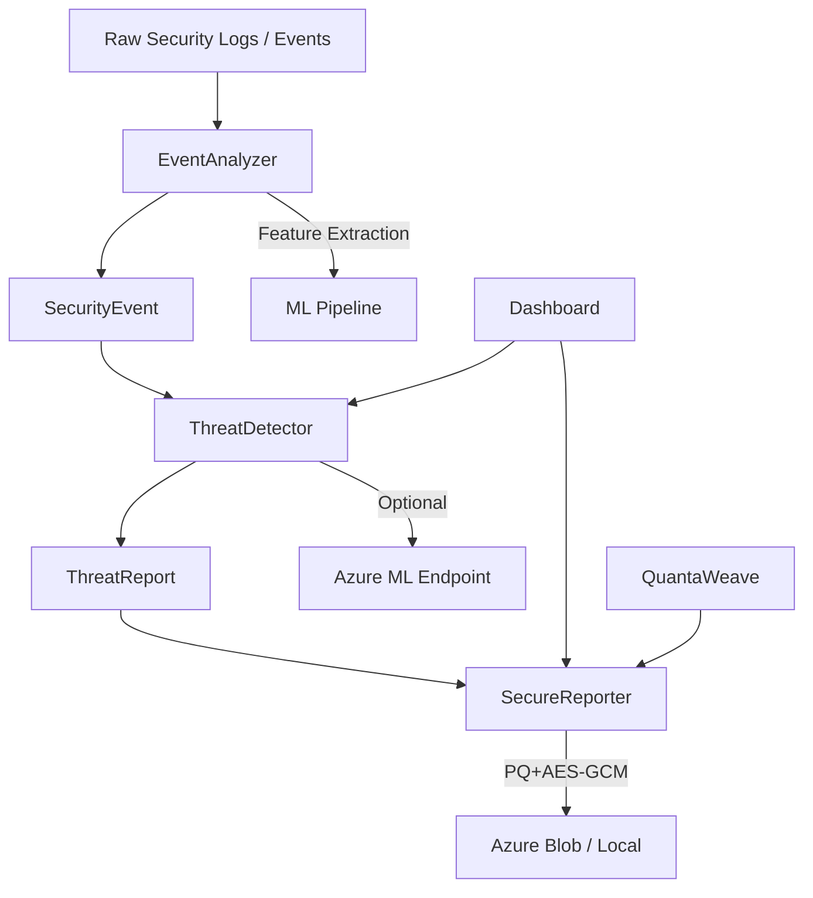

# Sentinel-Weave Project Architecture Blueprint

---

## 1. Project Overview

Sentinel-Weave is an AI-powered cybersecurity platform with post-quantum secure reporting. It integrates modular Python development, advanced threat detection, and Azure-based AI automation. The project extends the QuantaWeave library for post-quantum cryptography, providing real-world experience with PQ primitives.

---

## 2. Technology Stack

- **Python 3.10+**: Core language for all modules
- **Flask**: Dashboard web application
- **scikit-learn, pandas**: Machine learning pipeline and analytics
- **cryptography**: AES-GCM encryption for secure reporting
- **Azure SDKs**: Optional integrations (identity, key vault, blob, AI, monitor, cosmos, service bus, event hub)
- **QuantaWeave**: Post-quantum cryptography library (LWE KEM)
- **Yara, Capstone**: Binary analysis and malware detection
- **pwntools, volatility3**: Red-team/offensive toolkit

### Dependency Map
- Core runtime: cryptography
- Dashboard: flask, click, capstone, yara-python, scikit-learn, pandas
- Extras: pwntools, jinja2, volatility3, Azure SDKs

---

## 3. Architectural Pattern

- **Clean Architecture**: Modular, layered, async-ready design
- **Component boundaries**: Event analysis, threat detection, secure reporting, dashboard, PQ crypto, ML pipeline, Azure integration

### Layered Structure
- **Input Layer**: Raw logs/events
- **Analysis Layer**: EventAnalyzer (regex parsing, feature extraction, attack signature detection)
- **Detection Layer**: ThreatDetector (statistical baseline, z-score anomaly, threat classification, Azure ML integration)
- **Reporting Layer**: SecureReporter (hybrid PQ + AES-GCM encryption, report storage)
- **Presentation Layer**: Dashboard (Flask web app, CLI)
- **Crypto Layer**: QuantaWeave (PQ keygen, encryption, decryption)
- **Integration Layer**: Azure SDKs (optional telemetry, storage, ML inference)

---

## 4. Component Boundaries & Responsibilities

### EventAnalyzer
- Dependency-free
- Parses logs, extracts numeric feature vectors
- Detects well-known attack signatures (SSH brute-force, port scans, SQL injection, XSS, etc.)
- Extensible via `_SIGNATURES` list

### ThreatDetector
- Statistical anomaly detection (rolling baseline, z-score)
- Threat scoring and classification
- Optional Azure ML endpoint integration for advanced classification
- Converts anomaly scores and signature matches into ThreatReport objects

### SecureReporter
- Generates structured threat-intelligence reports
- Hybrid encryption: PQ (QuantaWeave LWE KEM) wraps AES-256-GCM session key
- Stores reports in Azure Blob Storage or locally
- Rationale: PQ encryption future-proofs confidentiality against quantum attacks

### Dashboard
- Flask web app and CLI interface
- Connects to reporting and detection modules
- Presents threat intelligence and system status

### QuantaWeave
- PQ crypto primitives (keygen, encryption, decryption)
- Modular bindings for new PQ algorithms
- Example usage:

```python
pqc = QuantaWeave(security_level='LEVEL1')
public_key, private_key = pqc.generate_keypair()
ciphertext = pqc.encrypt(b"Hello, Quantum World!", public_key)
plaintext = pqc.decrypt(ciphertext, private_key)
print(plaintext)  # b'Hello, Quantum World!'
```

### ML Pipeline
- Uses scikit-learn and pandas for advanced analytics
- Optional, can be extended for custom models

---

## 5. Component Diagram



---

## 6. Implementation Patterns

- **Dataclasses**: Used for structured event and report objects
- **Regex-based parsing**: For attack signature detection
- **Rolling statistical baseline**: For anomaly detection
- **Hybrid encryption**: PQ KEM wraps AES-GCM session key
- **Dependency injection**: For Azure integrations (optional)
- **Async-ready design**: CLI and dashboard can operate independently

---

## 7. Extensibility Points

- **Add new attack signatures**: Extend `_SIGNATURES` in event_analyzer.py
- **Plug in new ML models**: Integrate with ML pipeline or Azure ML endpoint
- **Custom storage backends**: SecureReporter can be extended for new storage targets
- **Crypto upgrades**: QuantaWeave supports new PQ algorithms via modular bindings

---

## 8. Cross-Cutting Concerns

- **Security**: PQ encryption, Azure Key Vault, secure report storage
- **Telemetry**: Azure Monitor, logging, anomaly scoring
- **Modularity**: Each layer/component is independently testable and replaceable
- **Performance**: Minimal dependencies in core, optional ML/analytics for advanced use

---

## 9. Deep Dive: Key Modules

### EventAnalyzer (event_analyzer.py)
- **Purpose**: Parses logs, extracts features, detects attack signatures
- **Patterns**: Uses regex for signature detection, dataclasses for event structure
- **Extensibility**: Add new signatures to `_SIGNATURES` list
- **Example**:

```python
_SIGNATURES = [
    ("SSH_BRUTE_FORCE", re.compile(r"Failed password for .* from [\d.]+", re.IGNORECASE)),
    ...
]
```

### ThreatDetector (threat_detector.py)
- **Purpose**: Statistical anomaly detection, threat scoring
- **Patterns**: Rolling baseline, z-score calculation, dataclasses for reports
- **Azure ML Integration**: Optional, via SDK and environment variables
- **Example**:

```python
class ThreatDetector:
    def detect(self, event):
        z_score = (event.value - self.mean) / self.std
        ...
```

### SecureReporter (secure_reporter.py)
- **Purpose**: Generates and stores encrypted threat reports
- **Patterns**: Hybrid encryption (PQ KEM + AES-GCM), dataclasses for report structure
- **Storage**: Azure Blob or local
- **Example**:

```python
reporter = SecureReporter()
pub, priv = reporter.generate_keys()
report_id = reporter.create_and_store(
    title="Brute-Force Attack Detected",
    events=threat_reports,
    public_key=pub,
)
```

### QuantaWeave (quantaweave/core.py)
- **Purpose**: PQ crypto interface (keygen, encryption, decryption)
- **Patterns**: Modular bindings, security level selection
- **Example**:

```python
pqc = QuantaWeave(security_level='LEVEL1')
public_key, private_key = pqc.generate_keypair()
ciphertext = pqc.encrypt(b"Hello, Quantum World!", public_key)
plaintext = pqc.decrypt(ciphertext, private_key)
```

---

## 10. Azure Integration (Optional)

- **Identity, Key Vault, Blob Storage, AI, Monitor, Cosmos, Service Bus, Event Hub**
- **Patterns**: Dependency injection, environment-based configuration
- **Telemetry**: Azure Monitor for logging and anomaly scoring
- **Storage**: Azure Blob for encrypted report storage
- **ML**: Azure ML endpoint for advanced threat classification

---

## 11. Testing & Validation

- **Unit tests**: Provided for core modules (event analysis, threat detection, reporting)
- **Integration tests**: Dashboard and Azure integrations
- **Test patterns**: Use dataclasses and dependency injection for testability

---

## 12. Summary & Maintenance

This blueprint provides a definitive reference for maintaining architectural consistency, extensibility, and security in Sentinel-Weave. Each component is modular, independently testable, and designed for future upgrades (PQ crypto, ML, Azure integrations).

For further detail, see the source files and module docstrings.

---

## 13. Extending and Adding to Sentinel-Weave

Sentinel-Weave is designed for extensibility. Here are practical ways to expand or customize the platform:

### 1. Add New Attack Signatures
- Extend the `_SIGNATURES` list in `event_analyzer.py` with new regex patterns for emerging threats.
- Example:
    ```python
    _SIGNATURES.append(("NEW_ATTACK", re.compile(r"new.attack.pattern", re.IGNORECASE)))
    ```
- Create new dataclasses for specialized event types if needed.

### 2. Integrate New ML Models
- Add custom ML models to the ML pipeline (scikit-learn, pandas).
- Plug in Azure ML endpoints for real-time inference (update `ThreatDetector`).
- Example:
    ```python
    from sklearn.ensemble import RandomForestClassifier
    model = RandomForestClassifier()
    model.fit(X_train, y_train)
    ```
- Use dependency injection for model selection/configuration.

### 3. Custom Storage Backends
- Extend `SecureReporter` to support new storage targets (e.g., S3, SQL, custom APIs).
- Implement new methods for storing/retrieving encrypted reports.
- Example:
    ```python
    class CustomReporter(SecureReporter):
        def store_report(self, data):
            # Custom storage logic
    ```

### 4. Add New Crypto Algorithms
- Add new post-quantum algorithms to QuantaWeave via modular bindings.
- Update keygen/encryption methods to support new schemes.
- Example:
    ```python
    class QuantaWeave:
        def add_algorithm(self, name, binding):
            self.algorithms[name] = binding
    ```

### 5. Dashboard Feature Expansion

Add new views, charts, or API endpoints to the Flask dashboard.
Integrate additional threat intelligence feeds or user controls.

#### Practical Example: Adding a Threat Intelligence Feed View and User Controls

1. **Create a new API endpoint for threat intelligence feeds:**
        ```python
        from flask import Blueprint, jsonify, request
        threat_feed_bp = Blueprint('threat_feed', __name__)

        @threat_feed_bp.route('/api/threat_feed', methods=['GET'])
        def get_threat_feed():
                # Example: fetch threat data from external API or local source
                feed = fetch_external_threat_feed()
                return jsonify(feed)
        ```
        Register the blueprint in your app:
        ```python
        app.register_blueprint(threat_feed_bp)
        ```

2. **Add a new dashboard view for displaying threat intelligence:**
        ```python
        @app.route('/threat_feed')
        def threat_feed_view():
                # Optionally fetch data server-side or via AJAX in template
                return render_template('threat_feed.html')
        ```

3. **Create a chart in the template (threat_feed.html):**
        ```html
        <canvas id="threatChart"></canvas>
        <script src="https://cdn.jsdelivr.net/npm/chart.js"></script>
        <script>
        fetch('/api/threat_feed')
            .then(response => response.json())
            .then(data => {
                const ctx = document.getElementById('threatChart').getContext('2d');
                new Chart(ctx, {
                    type: 'bar',
                    data: {
                        labels: data.labels,
                        datasets: [{
                            label: 'Threats',
                            data: data.values
                        }]
                    }
                });
            });
        </script>
        ```

4. **Add user controls (filter, refresh, etc.):**
        ```html
        <form id="filterForm">
            <label for="type">Threat Type:</label>
            <select id="type" name="type">
                <option value="all">All</option>
                <option value="malware">Malware</option>
                <option value="phishing">Phishing</option>
            </select>
            <button type="submit">Filter</button>
        </form>
        <script>
        document.getElementById('filterForm').addEventListener('submit', function(e) {
            e.preventDefault();
            const type = document.getElementById('type').value;
            fetch(`/api/threat_feed?type=${type}`)
                .then(response => response.json())
                .then(data => {
                    // Update chart with filtered data
                });
        });
        </script>
        ```

**Summary:**
- Add new API endpoints for external or internal threat feeds
- Create dashboard views and templates for visualization
- Use Chart.js or similar for charts
- Add user controls for filtering, refreshing, or customizing the feed

### 6. Azure Integration Enhancements
- Add new Azure services (e.g., Key Vault, Cosmos DB, Event Hub) via SDKs.
- Expand telemetry, storage, or ML integration as needed.
- Example:
    ```python
    from azure.keyvault.secrets import SecretClient
    client = SecretClient(vault_url, credential)
    secret = client.get_secret("my-secret")
    ```

### 7. Plugin/Module Pattern
- Use Python's importlib or entry points to allow dynamic loading of plugins.
- Example:
    ```python
    import importlib
    plugin = importlib.import_module('my_plugin')
    plugin.run()
    ```
- Define a plugin interface for new threat detectors, reporters, or dashboard modules.

### 8. CLI Tooling
- Add new CLI commands or options in `sentinel_weave/cli.py`.
- Example:
    ```python
    import click
    @click.command()
    def new_command():
        click.echo("New CLI feature!")
    ```

### 9. Testing and Validation
- Add new unit/integration tests for any new feature or module.
- Use pytest or unittest for coverage.

---

**Best Practice:** Keep new features modular, use dataclasses for structured data, and follow dependency injection for easy testing and configuration. Document new modules and update this blueprint as the architecture evolves.
